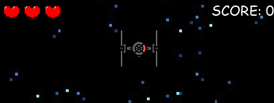
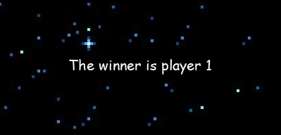

# **Space Destroyer**

A spaceships platform multiplayer game.

# Introduction

The game logic was created with pygame and the multiplayer was created with the libraries sockets and threading.

This project contains two elements:
1. The server
2. The client

The server is independent from the game, this means that you can run it from another place or computer that is connected to the same local network as the clients.

At enter the game, the client has two options, and the server and the player playing in this moments decide what you do. If exist a player waiting for a teammate, the server connects you with him, otherwise, you the server will have you waiting for another player.

For the above, the game needs, at minimum, two successful connections to start (two clients). 

# How To Play

The game consists in defeat the other player shooting him laser bullets, when you hit a shot, the score increase in one point. Each heart resists 6 hits, so if you receive 18 hits, you lose the game.

You can only move your spaceship sideways, and you can shoot a bullet with crtl key. You can shoot at most three bullets, so if you have three bullets on the screen, when a bullet hit the enemy or get out the screen you can shoot 1 more.

# Game Caracteristics

If you are waiting for another player to play, the game shows you a waiting message and don't show the other player.


When the 2 players are connected, the game shows all the interface which is made up of the lives, scores and players.


### **Player 2**


### **Player 1**


And when a player defeat his teammate, the game shows a message with the winner.



# Requirements

- Python 3.x
- Pygame 2.1.2

# How To Play

To start the server:

```console
$ python Server/server.py
```
To open a game client:

```console
$ python main.py
```

# Bugs/Errors

1. The changes in the score and life depend the client. **(Fixed)** 
2. When two players finish the game, the server does not remove his data, saving trash info in memory.
